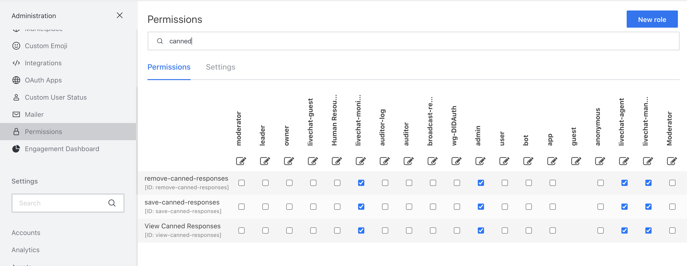

# Canned responses


Canned responses allow you to save message snippets that you can call with shortcuts \(preceded with `!`\) to communicate a quick note to your visitors in Omnichannel and for messaging in regular conversations inside your Rocket.Chat workspace.


As an omnichannel administrator, you can configure and manage omnichannel email inboxes or email accounts for the email channels.

## Enable Canned Responses on your workspace

To enable canned responses on your workspace:

1. Go to **Administration**:

2. Search **Canned Responses** in **Settings**, **Enable** it, and hit **Save Changes**:

3. Define which user roles should be able to view, create and delete the canned responses. Go to `Administration` -&gt; `Permissions` and use search to filter the canned responses permissions only:

4. Enable `Omnichannel`. 


Using canned responses in regular conversations with other users of your workspace will require the Omnichannel feature to be enabled.


## Create a new Canned Response:

To create a canned response on your workspace:

1. Go to **Omnichannel**:

2. Click **Canned responses** and hit **Create Your First Canned Response**:

Your new canned response screen is shown below:

### Shortcut

Please set a Shortcut for your new canned response preceded by an exclamation mark \(!\), as shown below:

### Message

Enter your message using any placeholders you want, as shown below:

You can also preview the message at any time during the creation process:

### Tags

You can set tags for your canned response if you want, as shown below:


Canned responses tags help agents find canned responses specific to a particular topic.


### Sharing

You can share your canned response according to your need. 

1. **Public**: Anyone across your workspace can access your canned response.

2. **Department**: Anyone in the selected department can access your canned response.

3. **Private**: Only you and Omnichannel managers can access your canned response.

 __

Try using a canned response in a conversation. Start your message with `!` and a shortcut, or simply select the canned response from the drop-down list that will appear above your text field:

You can also use the same canned responses when talking to your peers outside Omnichannel.

To delete or edit a canned response, open the canned responses dialog in the respective department. Select the response that you wish to delete or edit.

